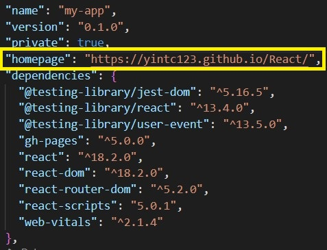
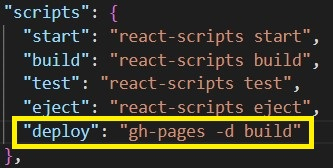

# gh-pages
## Introduction
此套件可以讓使用者於 GitHub Pages 部署自己的 SPA 專案。
## Setup
- package.json 設置 "homepage"：加入 GitHub Pages 的網址（如下圖）</br>

- package.json 設置 "scripts"：加入一指令 deploy（如下圖）</br>

- 於 index.html 的 head 標籤內設置一段 JavaScript［<a href="https://github.com/Yintc123/React/blob/main/my-app/public/index.html">Goto</a>］
- 新增一自訂的 404.html［<a href="https://github.com/Yintc123/React/blob/main/my-app/public/404.html">Goto</a>］

## Steps
1. 將專案打包至 build 資料夾：npm run build
2. 將專案部署至 Github Pages：npm run deploy

## Problem
問題：由於 GitHub Pages 僅支援靜態網站，網址需對應到真實路徑，故 SPA 的專案請求其他路徑的頁面會回傳 404.html。</br>
解決：自訂的 404.html 將網址導回 index.html 並且 index.html 將網址修改為目標網址。</br>
運作：
1. GitHub Server 找不到對應路徑的資源，返回 404.html（如無自訂的 404.html，會返回 GitHub 定義的 404.html）
2. 自訂的 404.html 將網頁導回 index.html 並將路徑等參數以 Query String 的方式呈現於網址
3. index.html 使用 window.history.replaceState() 將網址修改為目標網址並且渲染畫面


註：在 SPA 的專案中，會於 Web Server 設置所有請求路徑皆回傳 index.html（如下 Nginx 的 URI 匹配設置）
```nginx file
location / {
    root   /usr/share/nginx/html;
    index  index.html index.htm;
    try_files $uri $uri/ /index.html; # 找不到資源回傳 index.html
}
```

## Reference
<ol>
    <li>https://github.com/rafgraph/spa-github-pages</li>
    <li>https://timtnlee.me/post/github-pages-spa/</li>
    <li>https://ithelp.ithome.com.tw/articles/10228423</li>
    <li>https://leader.js.cool/basic/knowledge/github-pages-spa-router/</li>
    <li>https://blog.yyisyou.tw/8357407a/</li>
</ol>

## Tips
### 網頁轉址：
#### window.location.assign(assigned_new_URL)：網頁轉至指派的網址。
Example：
1. 目前頁面：https://google.com/
2. 於網址列輸入：https://youtube.com/
2. F12 開啟開發者工具並且於主控台輸入：window.location.assign("https://example.com/")
3. 網頁導轉至：https://example.com/
4. 回上一頁：https://youtube.com/
#### window.location.replace(assigned_new_URL)：以指派的網址取代目前網址。
Example：
1. 目前頁面：https://google.com/
2. 於網址列輸入：https://youtube.com/
2. F12 開啟開發者工具並且於主控台輸入：window.location.replace("https://example.com/")
3. 網頁導轉至：https://example.com/
4. 回上一頁：https://google.com/
### window.location.pathname：網址的路徑名稱。
Example（以此網頁為例 https://yintc123.github.io/React/?/page1 ）：
- pathname：/React/
### window.location.search：網址的 Query String。
Example（以此網頁為例 https://yintc123.github.io/React/?/page1 ）：
- search：?/page1
### window.history.replaceState(state, title, new_URL)：不送出 request 的狀況下，修改 URL。
Example（以此網頁為例 https://yintc123.github.io/React/?/page1 ）：
1. 404.html 將網頁導轉至：https://yintc123.github.io/React/?/page1
2. index.html 將網址修改為：https://yintc123.github.io/React/page1
### Reference
<ol>
    <li>https://originalix.github.io/2020/05/10/window.location%E7%94%A8%E6%B3%95%E8%AF%A6%E8%A7%A3/</li>
    <li>https://medium.com/%E5%89%8D%E7%AB%AF%E5%AF%A6%E5%8A%9B%E4%B8%89%E6%98%8E%E6%B2%BB/%E7%80%8F%E8%A6%BD%E5%99%A8%E7%9A%84%E6%99%82%E5%85%89%E6%A9%9F-pushstate-replacestate-api-fa1d909c82b0</li>
    <li>https://developer.mozilla.org/zh-CN/docs/Web/API/History/replaceState</li>
    <li>https://ithelp.ithome.com.tw/articles/10273613</li>
</ol>

## <a href="https://github.com/Yintc123/React">HOME</a>